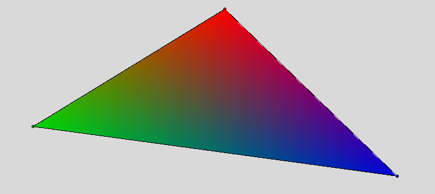

# Algoritmo de Fill Poly

> Projeto: *Fill Poly (Scanline)*

> Mátéria: Computação Gráfica

> Desenvolvido por: [Gabriel Mazzuco](https://github.com/gabrielmazz)


## Indice

- [Descrição do Projeto](#descrição-do-projeto)
- [Pré-requisitos](#pré-requisitos)
- [Como usar](#como-usar)
    - [Fill Poly](#fill-poly)
        - [Explicando um pouco de como foi implementado](#explicando-um-pouco-de-como-foi-implementado)
    - [Carregando dados de um arquivo](#carregando-dados-de-um-arquivo)
        - [Formato do arquivo](#formato-do-arquivo)
- [Referências](#referências)

## Descrição do Projeto

<p align="justify">O algoritmo de Fill Poly é um algoritmo de preenchimento de polígonos, que consiste em preencher um polígono com uma cor sólida, a partir de um ponto inicial. O algoritmo é baseado no algoritmo de Scanline, que consiste em preencher uma linha horizontal, a partir de um ponto inicial, até um ponto final. </p>

<p align="justify"> O código usa como base um poligono definido pelo usuário, esse poligono usa seus vértices para definir aonde começa e termina o preenchimento. Definido pelo usuário também as cores que serão usadas para o preenchimento, assim realizando uma interpolação, causando o efeito degradê. </p>

<p align="center">
    
</p>

## Pré-requisitos

Antes de começar, você vai precisar ter instalado em sua máquina as seguintes ferramentas:

- [Python](https://www.python.org/downloads/), versão 3.8.5 ou superior
    - `sudo apt-get install python3.8`

- [Tkinter](https://docs.python.org/3/library/tkinter.html), versão 8.6 ou superior
    - `sudo apt-get install python3-tk`
    - Usado no código para a criação da interface gráfica e todas as suas funcionalidades

- [Pillow](https://pillow.readthedocs.io/en/stable/), versão 8.0.1 ou superior
    - `pip install pillow`
    - Usado no código para manipulação de imagens e a possibilidade de tirar prints da tela do tkinter

- [Rich](), versão 9.2.0 ou superior
    - `pip install rich`
    - Usado no código para criação de tabelas e logs mais organizados sobre a demonstração do log do algoritmo

## Como usar

<p> Para usar o algoritmo, basta executar o arquivo `main.py` com o comando, dentro da pasta do projeto: </p>

```bash
python3 main.py
```

<p align="justify"> Após isso, uma janela irá abrir, com a interface gráfica do algoritmo. 

<p align="center">
    

<p align="justify"> Para começar, basta clicar com o botão esquerdo do mouse, nos pontos que deseja criar o primeiro polígono, tendo a possibilidade de criar quantos polígonos quiser apenas clicando no menu <em>Editar</em> e clicando em <em>Novo Polígono</em>. Dentro deste menu, também é possível editar os polígonos já criados, excluindo-os ou limpar completamente a tela. </p>

<p align="center">
    
</p>

<p align="justify"> Após criar os polígono, é possivel escolher várias opções de edição para o poligo <em>Pintar arestas</em>, <em>Pintar vertices</em>, <em>Pintar poligono</em>, tudo isso sendo possivel apenas se escolher a cor do objeto no mesmo menu, isso irá abrir uma palheta de cores do próprio tkinter, onde é possivel escolher a cor desejada. </p>

<p align="center">
    

<p align="center">
    

<p align="justify"> Para usar as opções nos poligonos, é atribuido o botão direito para realizar todas as ações esperadas. </p>

<p align="justify"> Existe também o menu de <em>Debug</em> aonde é possivel ver o log do algoritmo, aonde é mostrado como está a disposição das listas que o programa utiliza na sua execução, dentre as suas informações, é possivel ver quais são os polígonos que estão sendo preenchidos, quais são as arestas que estão sendo pintadas, quais são os vértices que estão sendo pintados, quais são os polígonos que estão sendo apenas pintados, e quais são os vértices globais que estão sendo criados no formato de tabelas, usadas pela biblioteca <em>Rich</em>, tudo sendo mostrada no terminal.</p>

<p align="center">
    


### Fill Poly

<p align="justify"> Para realizar o uso do algoritmo de Fill Poly que é o intuito do projeto, basta clicar no menu <em>Pintar</em> e clicar em <em>Fill Poly</em> também com o botão direito do mouse, depois de ter escolhido um cor para cada vértice do polígono. </p>

<p align="center">
    

<p align="justify"> É possivel ver de forma visual quais cores foram escolhidas para cada vértice pois ele estará pintado com a cor escolhida. </p>

<p align="center">
    

<p align="justify"> Caso os três vértices do polígono não tenham sido pintados, o algoritmo irá retornar uma mensagem de erro, informando que não é possivel realizar o preenchimento do polígono. Portanto, é necessário pintar os três vértices do polígono para que o algoritmo funcione corretamente. </p>

<p align="center">
    

<p align="justify"> Interessante ressaltar que o algoritmo é bem lerdo e não é possivel atualizar a tela a todo momento, por exemplo quando editamos os vértices de um polígono, ele não atualiza o fill poly iterativamente, portanto devemos clicar no menu <em>Refresh</em> e clicar em <em>Refresh Fill Poly    </em> para atualizar os poligonos que estão preenchidos mas agora nas suas novas posições.</p>

#### Explicando um pouco de como foi implementado

<p align="justify"> O algoritmo de Fill Poly é baseado no algoritmo de Scanline, que consiste em preencher uma linha horizontal, a partir de um ponto inicial, até um ponto final. O algoritmo de Scanline é usado para preencher um polígono, a partir de um ponto inicial, até um ponto final, e assim preenchendo o polígono. </p>

<p align="justify"> O código da implementação foi feito em um arquivo separado chamado `fill_poly.py`, onde contém a função `fill_poly`, que recebe como parâmetro os vérices do polígono</p>

<p align="justify"> Primeiramente ele determina qual é o menor e o maior valor de y dos vértices do polígono, para saber aonde começa e termina o preenchimento. </p>

```python
min_y = min(vertices, key=lambda p: p[0][1])[0][1]
max_y = max(vertices, key=lambda p: p[0][1])[0][1]
```

<p align="justify"> Posteriormente ele percorre cada linha e verificando as interseções entre essa linha e as arestas do triângulo. Criando uma lista com todas as interseções, e depois ordenando essa lista de acordo com o valor de x de cada interseção. </p>

<p align="justify"> Nas suas verificações ele adiciona uma tolerância de 0.000001 para que não ocorra erros de arredondamento, e assim não ocorra erros no algoritmo. </p>

```python
if y1 <= y + 1e-6 <= y2 or y2 <= y + 1e-6 <= y1:
    if y2 - y1 != 0:
        x = int(x1 + (y + 1e-6 - y1) * (x2 - x1) / (y2 - y1))
        intersections.append(x)
```

<p align="justify"> Depois de tudo, ele parte para o preenchimento aonde ele cria linha por linha, e preenche cada linha com a cor correspondente da interseção, calculando os pesos de interpolação para cada vértice de um triângulo, que são usados para criar um efeito de gradiente ao preencher o triângulo. </p>

<p align="justify"> Inicializa uma lista d para armazenar as distâncias entre cada vértice do triângulo e um ponto de referência (x, y). Calcula a distância euclidiana entre cada vértice e o ponto de referência e armazena essas distâncias em d </p>

```python
d = [((vx - x) ** 2 + (vy - y) ** 2) ** 0.5 for ((vx, vy), _) in vertices]
```

<p align="justify"> Calcula a soma dos inversos dos quadrados de cada distância em d para obter o valor total. Isso evita a divisão por zero adicionando um pequeno valor ao denominador.

```python	
total = sum(1 / ((di + 1e-6) ** 2) for di in d)
```

<p align="justify"> Calcula os pesos de interpolação para cada distância em d dividindo o inverso do quadrado da distância pelo valor total. Isso garante que as cores dos vértices sejam interpoladas de acordo com a distância ao ponto de referência, criando um efeito de gradiente. A cor será mais forte perto dos vértices, onde o peso de interpolação é maior, e ficará mais fraca à medida que se afasta dos vértices. </p>

```python
t = [(1 / ((di + 1e-6) ** 2)) / total for di in d]
```

### Carregando dados de um arquivo

<p align="justify"> Para carregar os dados de um arquivo, basta clicar no menu <em>Arquivo</em> e clicar em <em>Carregar dados</em>, isso irá abrir uma janela para escolher o arquivo que deseja carregar. </p>

<p align="justify"> Primeiramente deve ter sido salvo previamente um arquivo com os dados de um polígono, para isso basta clicar no menu <em>Arquivo</em> e clicar em <em>Salvar dados</em>, isso irá abrir uma janela para escolher o local e o nome do arquivo que deseja salvar, tudo que está na tela será salvo no arquivo. </p>

<p align="center">
    

#### Formato do arquivo

<p align="justify"> O arquivo é salvo no formato <em>.tk</em> com o nome indicado pelo próprio usuário, sendo com o seguinte formato: </p>

```
vertices_globais = [(x1, y1), (x2, y2), (x3, y3)]
lista_poligonos_preenchidos = [Px, [[(V1, V2), (R, G, B)], [(V2, V3), (R, G, B)], [(V3, V1), (R, G, B)]]]
lista_arestas_pintadas = [[(x1, y1), (x2, y2)], (R, G, B), (a1, a2), Px]
lista_vertices_pintados = [(x1, y1), (R, G, B), Px, Vx]
lista_poligonos_apenas_pintados = [Px, (R, G, B)]
```

<p align="justify"> Onde: </p>

- `vertices_globais`: é uma lista com todos os vértices que foram criados na tela, sendo que cada vértice é uma tupla com as coordenadas x e y do vértice
- `lista_poligonos_preenchidos`: é uma lista com todos os polígonos que foram preenchidos com o algoritmo de *fill poly*, sendo que cada polígono dentro da lista é dado pelo seu número *Px*, coordenadas do vértice *V1*, *V2* e *V3* que formam o polígono, e a cor *R*, *G* e *B* que foi escolhida para o polígono
- `lista_arestas_pintadas`: é uma lista com todas as arestas que foram pintadas, sendo que cada aresta dentro da lista é dada pelas coordenadas *x1*, *y1*, *x2* e *y2* que formam a aresta, e a cor *R*, *G* e *B* que foi escolhida para a aresta
- `lista_vertices_pintados`: é uma lista com todos os vértices que foram pintados, sendo que cada vértice dentro da lista é dado pelas coordenadas *x* e *y* do vértice, e a cor *R*, *G* e *B* que foi escolhida para o vértice, além do número *Px* que indica qual polígono o vértice pertence e o número *Vx* que indica qual vértice do polígono o vértice é
- `lista_poligonos_apenas_pintados`: é uma lista com todos os polígonos que foram apenas pintados com cores simples, sem usar o algoritmo de fill poly, sendo que cada polígono dentro da lista é dado pelo seu número *Px*, e a cor *R*, *G* e *B* que foi escolhida para o polígono

## Referências

- [INE 5420 - Computação Gráfica - Aula 11.1.Rasterização](https://www.youtube.com/watch?v=huw7fJcSwQY)
- [Scan Line Polygon Fill Algorithm | Example Of Scan Line Polygon Fill Algorithm | Computer Graphics](https://www.youtube.com/watch?v=7QYn2FyIf7A)
- [OpenAI. (2023). GPT-3.5: Modelo de Linguagem Pré-Treinado](https://openai.com/blog/chatgpt)
- [BingAi. (2023). GPT-4.0: Modelo de Linguagem Pré-Treinado](https://www.bing.com/)
- [OpenAI e GitHub. (Ano). GitHub Copilot: Ferramenta de Autocompletar de Código](https://copilot.github.com/)